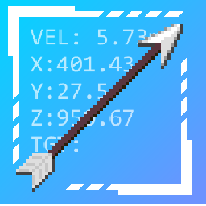
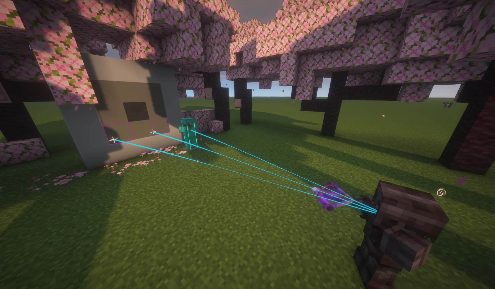
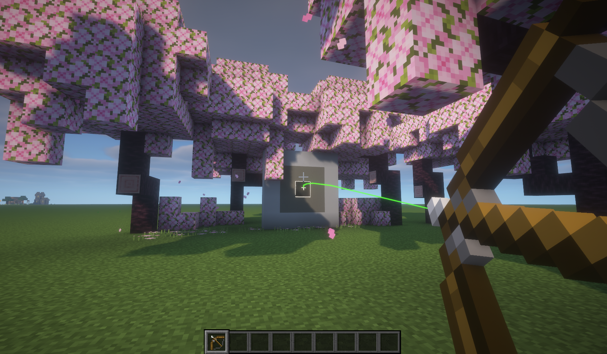
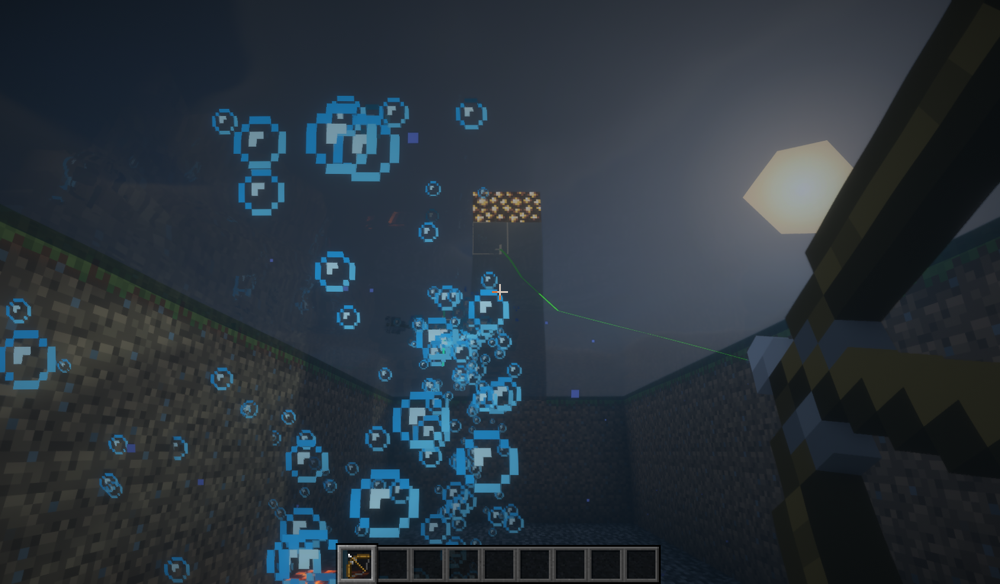

  
  

    <h1>S4I's Projectile Trajectory Overlay</h1>
    <h3>(Minecraft mod) Displays trajectories for projectiles fired/thrown by players.</h3>
  

## ℹ️ Features
Since other mods which do the same thing are not even accurate or are outdated, I made my own.

- Predicts and displays trajectory of players' fired projectiles
- Works while in minecarts, boats, riding horses, flying and even underwater
- Highlights impact points
- Outlines entities hit
- Fully customizable colors and ability to disable certain features

Planned:
- Mod support

## 🔧️ Requirements
- Fabric Loader - 0.18.3 or higher
- [Fabric API](https://modrinth.com/mod/fabric-api) - 0.141.3 or higher

Optional, but recommended (to access the settings screen):
- [ModMenu](https://modrinth.com/mod/modmenu)
- [Cloth Config API](https://modrinth.com/mod/cloth-config)

You can also manually acces the config file under
`your-minecraft-installation-path/config/s4i-projectile-trajectory-overlay.json`, but I do not recommend it.

## ⚠️ Incompatible mods
- **Any mods which disable the debug render layers**
- Entity multithreading optimization mods might not play nice with this one (haven't tested yet)

## 🚧 Disclaimer
Using this mod in multiplayer servers is considered cheating and might break their rules.
I recommend using this mod in singleplayer only.

Use this mod on multiplayer servers at your own risk, I take no responsibility or liability for any action taken
against your Minecraft account.

## 📋 FAQ
### Will this mod be downgraded to version X?
No. Too many API changes and projectile changes in the last few versions. 
Will only support Minecraft version 1.21.11 and higher.

### Is this mod compatible with Fabulously Optimised modpack?
As far as I am aware, yes.

### Mod support for other weapons / projectiles?
Currently, none, but willing to support other mods.

If you enjoy this mod and want to see this work with projectiles / bows / crossbows / whatever from other mods,
raise a ticket in the `Issues` tab of this mod's GitHub repository. **IF there are multiple people voting for the same
ticket, I'll consider implementing it.**

### NeoForge / other mod loader support?
Currently, only Fabric.

Same as above, if it is wanted by multiple people, I will add support for other loaders.

### Game crashes with this mod :(
Create an issue in the `Issues` tab and add the error, stacktrace, steps to reproduce and full mod list.
I will close tickets missing any of these.

### I found a bug and/or I have a suggestion
In the `Issues` tab it goes.

### Performance is bad
~~Works fine on my machine.~~ But if it doesn't on yours, there is a performance tab in the settings, 
turn some of the more computationally expensive features off.

### But I'm too lazy to install it, how does it look like?
  
  
  

### What shaders did you use in the example pics?
[BSL Shaders](https://modrinth.com/shader/bsl-shaders)